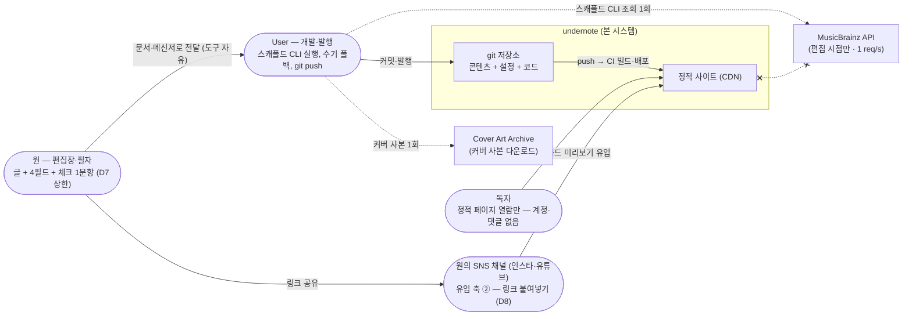
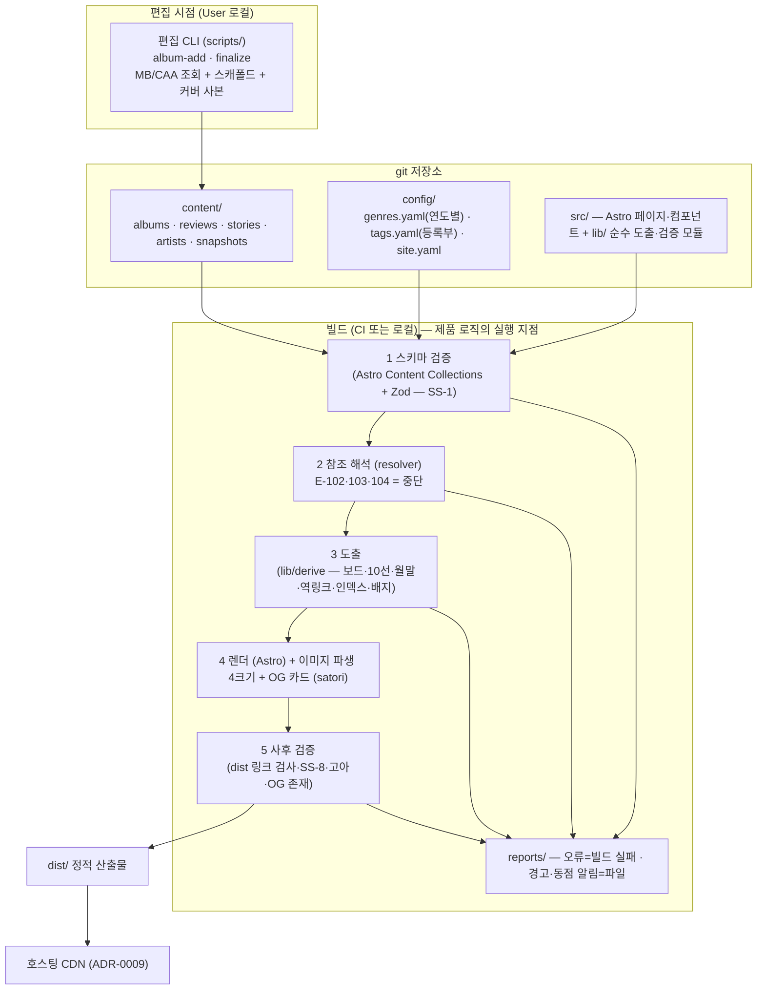

# undernote — 아키텍처 개요 (C4)

| | |
|---|---|
| 작성 | James (역할 #4 · 아키텍트) · 2026-09-01 |
| 입력 | charter v2 · Joshua 기획 5종 (v1.1) · `01-reverse/reverse-summary.md` · ADR-0001~0010 |
| 한 줄 | **런타임이 없는 시스템.** 제품의 전 로직은 빌드 타임에 실행되고, 독자가 만나는 것은 CDN 위의 정적 HTML뿐이다 |

---

## 0. 형태를 결정한 세 가지 사실

1. **쓰는 사람 1(원) · 발행하는 사람 1(User) · 참여하는 유저 0** (charter §5·§6) → 동시성·계정·런타임 상태가 존재하지 않는다.
2. **모든 리스트는 평론 메타데이터의 함수다** (D3·D4) → 제품 로직 = 순수 함수 도출 + 검증. 서버가 아니라 빌드가 제품이다.
3. **제품의 약속(USP-A: 리스트 전 항목이 평론으로 뒷받침)은 기능이 아니라 불변식이다** → 아키텍처의 중심 부품은 화면이 아니라 **빌드 게이트**(검증 파이프라인)다.

**A4 판정 (Joshua §3 입력의 비준): ML 불필요 확정.** 수십 편 규모 + 추천 기능 철회(charter B7·§5).
W5 Stephen 미스폰과 정합. 재검토 트리거 없음.

## 1. C4 — L1 System Context

- 배포 사이트 ↔ 외부 API 호출 = **0** (SS-2 · John 확인 사항). 그림의 x-.-x가 그 금지선이다.
- 원의 접점은 시스템 바깥이다 — 원은 이 시스템의 어떤 도구도 배우지 않는다 (D7).

## 2. C4 — L2 Container

## 3. C4 — L3 Component (빌드 내부 — W5 구현 단위)

| 컴포넌트 | 책임 | 소비 SS |
|---|---|---|
| `content collections 스키마` | 유형별 필수/형식 검증. 실패 = 빌드 중단 | SS-1 |
| `lib/score` | 문자열 ↔ 십분위 정수 (ADR-0004). 유일한 점수 파서 | SS-3 |
| `lib/derive/lists` | 보드·10선·월말정산 도출 + 동점 알림 산출. **순수 함수 — 골든 테스트 대상** | SS-3·4·5·7 |
| `lib/derive/links` | 참조 해석·역링크·사다리 폴백 사슬·아티스트 집계·아카이브 인덱스·배지 | SS-9·10·11·12 |
| `lib/checker` | 참조 무결성·태그 정규화·1:1·링크율 100%·고아·OG — E-* 전수 + build-report | SS-1·2·8·15 |
| `lib/listen-links` | 검색형 듣기 링크 템플릿 적용 + 수기 우선 | SS-13 |
| `og/` | 카드 3템플릿 렌더 (ADR-0010) | SS-15 |
| `scripts/*` | 편집 시점 CLI (MB/CAA 어댑터 포함 — 폴백은 여기서) | SS-2·6·14 |

페이지(라우트 8종 — Jonnathan 합의 2026-09-01): `/` · `/reviews/{slug}/` · `/stories/{slug}/` ·
`/artists/{slug}/` · `/list/{year}/` · `/list/{year}/{mm}/` · `/archive/...` · `/about/`.

## 4. NFR — 수치는 전부 "설계 예산"이다 (베이스라인 실측 전 — 측정치로 오독 금지)

| 항목 | 예산 | 근거·비고 |
|---|---|---|
| 페이지 무게 | 초기 전송(HTML+CSS+폰트) < 500KB · 클라이언트 JS = **0** | Jonnathan 합의. 폰트 서브셋 woff2 합계 < 1.5MB 캐시 |
| 이미지 | 커버 파생 개당 ≤ 100KB (WebP) · 최장변 640px 상한 | ADR-0008 §2 (법적 제약이자 성능 예산) |
| 빌드 시간 | 콘텐츠 300건 기준 < 60초 | 외부 참고치(Astro 500p ~18s) 기반 예산 — 실측 후 조정 |
| 응답 지연 | 별도 p95 목표 **미설정** — 정적+CDN 특성상 페이지 무게 예산이 실질 지표 | 런타임 없음. 원점 서버 부재 |
| 가용성 | 호스트 CDN 의존. 무료 티어 SLA **미확인** — W5 벤더 확인 시 기록 (ADR-0009) | 자체 SLO 설정은 무의미(개인 프로젝트·무료 티어) — 정직하게 비움 |
| 비용 | 월 $0 목표 (도메인 등록비 제외) | charter §6 |
| 규모 한계 | 전량 재계산 설계는 콘텐츠 ~수천 건까지 유효 — 5년차 외삽(<600)의 5배 여유 | data-model §5 |

## 5. 보안 (STRIDE 요약 — 런타임 부재가 최대 방어)

| 위협 | 해당 여부 · 대응 |
|---|---|
| Spoofing | 도메인 + HTTPS 자동 (ADR-0009 요건 ②). 그 외 인증 주체 없음 |
| Tampering | 공격면 = git 저장소·CI뿐 → 2FA·보호 브랜치·잠금 파일(lockfile) 커밋. 사이트는 읽기 전용 산출물 |
| Repudiation | 해당 없음 (단일 작성자 · git 이력이 감사 로그) |
| Info disclosure | 비밀값 자체가 없음 — MB 읽기 무인증, DB·키 없음. 저장소 공개 여부는 User 자유 (콘텐츠 저작권상 비공개 권장) |
| DoS | CDN이 흡수. 원점 없음 |
| Elevation | 런타임 권한 체계 없음 |
| 공급망 | 의존성 최소 원칙 + lockfile + CI에서 `npm ci` 고정 |
| 입력 검증 | "입력"은 원·User의 콘텐츠뿐 — 빌드 게이트가 전수 검증 (exceptions.md) |

## 6. 관측 가능성

- **빌드가 유일한 실행이므로 관측 = 빌드 리포트다.** 오류(빌드 실패)·경고·동점 알림을 `reports/`
  산출 (SS-3). CI 로그 = 실행 이력. 상태 페이지·APM 불요.
- **독자 행동 계측** (charter §3 — 체류·이동률 실측용): 쿠키리스 경량 계측 1종을 W5에서 선정
  (후보: 호스트 내장 분석 · GoatCounter 류 — 무료 한도 **미확인**, ADR-0009 확인과 함께).
  "클라이언트 JS 0" 원칙의 유일한 예외 후보로 명시하며, 스니펫 1개 초과 금지. 선정 전까지는 계측 없음.
- 업타임 = 호스트 책임. 자체 모니터링은 만들지 않는다 (1인 운영 비용 원칙).

## 7. 문서 지도

`data-model-erd.md`(관계·접근 패턴) → `api-contracts.md`(기계가독 규범) →
`service-sequences.md`(SS별 흐름) → `exceptions.md`(오류 전수·결정성 규범) →
`code-structure.md`(경계) → `design-patterns.md`(패턴) → `build-plan.md`(W5 실행) → `adr/`(결정 봉인)
