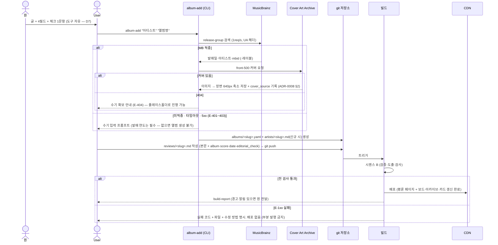
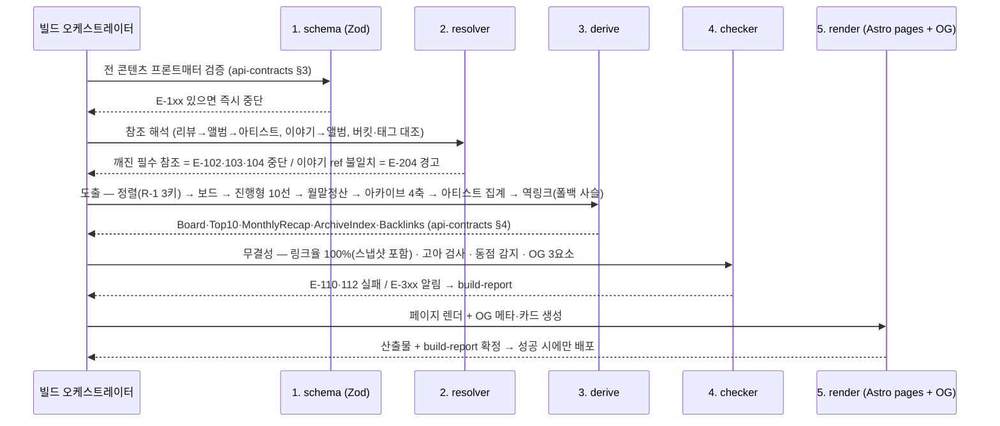
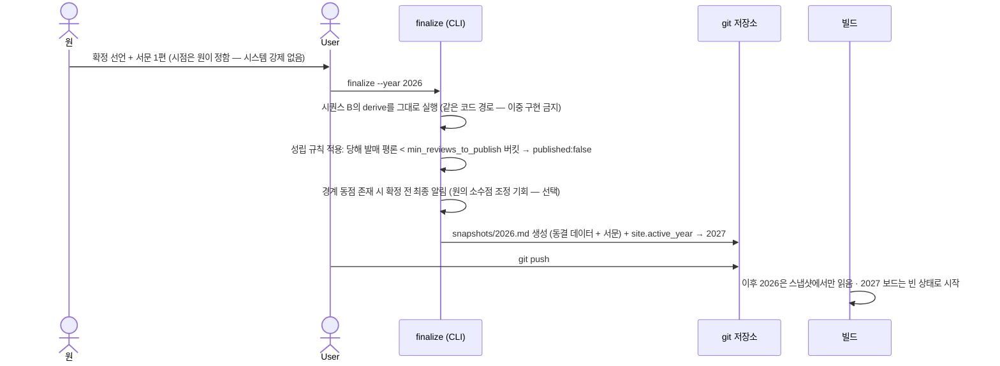

# undernote — Service Sequences (SS-1 ~ SS-15)

| | |
|---|---|
| 작성 | James · 2026-09-01 |
| 입력 | `service-stories.md` v1.1 — 각 SS의 트리거·규칙·예외·인수조건을 실행 순서로 전개 |
| 전제 | "요청→응답"의 요청자는 독자가 아니라 **빌드**다. 독자 요청은 CDN이 정적 파일로 응답할 뿐 시퀀스가 없다. 시퀀스가 있는 곳은 ① 발행(편집 시점) ② 빌드 ③ 연말 확정 셋이다 |
| 오류 코드 | 전부 `exceptions.md` E-* 참조 |

---

## 시퀀스 A — 평론 발행 (SS-1 · SS-2 · SS-13 · SS-14 · US-10)

원의 개입은 1단계뿐이다. 이 시퀀스의 검증 목적은 **D7 상한 준수**다.



**엣지 전개:**

| 엣지 | 처리 | SS |
|---|---|---|
| 점수 누락·`8.35`·범위 밖 | E-105 빌드 실패, 항목 명시 | SS-1·3 |
| 버킷 미기입 | E-104 실패. "그 외"는 `bucket: etc`로 명시 입력 (침묵 기본값 금지) | SS-1 |
| 세부 태그 미기입 | 정상 발행 — 옵션 (US-10 AC5) | SS-1 |
| 미등록 태그 표기 | E-201 경고 + 등록부 추가 제안. 발행 진행 | SS-1 |
| MB 미등재 신보 (B6 지연) | 수기 우선 입력, `mbid` 추후 연결 | SS-2 |
| 발매 연도 불명 | 앨범 생성 불가 (E-102 계열) — 연도 없이는 리스트 귀속 불능 | SS-2 |
| 듣기 링크: 수기 있음 | 자동 검색형보다 우선 표시 | SS-13 |
| 듣기 링크: 자동·수기 모두 불가 | E-205 경고, 링크 영역 미표시로 발행 | SS-13 |
| 커버 미확보 | E-202 경고 + 플레이스홀더 발행. OG는 텍스트 기본형 카드 | SS-14·15 |

---

## 시퀀스 B — 빌드 파이프라인 (매 빌드 공통 — SS-3·4·5·7·8·9·10·11·12·15)

모든 도출은 **매 빌드 전체 재계산**이다 (증분 없음 — 규모 근거는
`data-model-erd.md` §4). 단계 순서가 곧 의존 순서다.



**단계별 규칙 전개:**

### B-1. 검증 (SS-1) — 실패는 빠르게, 전부 모아서
- 전 파일을 검사하고 **실패를 전부 모아 한 번에 보고**한다 (첫 실패에서 멈추면
  User가 n회 왕복한다). 성공 판정은 실패 0일 때만.

### B-2. 도출 정렬 (SS-3 · R-1)
- 전 리스트 공통 정렬 키: `score desc → review.date asc → album slug asc`.
  3차 키(slug)는 아키텍처 추가 — 같은 날 동점까지 결정성을 보장한다
  (근거: `exceptions.md` R-1).
- 보드 5위 경계 동점(6위와 점수 동일) → E-301 알림 생성, 기본 규칙으로 처리
  진행. **빌드를 막지 않는다** (SS-3 예외).

### B-3. 보드 도출 (SS-4)
- 대상: `activeYear` 발매 앨범의 평론 × 당해 `BucketConfig` 버킷 (etc 제외).
- 버킷별 상위 5. 평론 5편 미만 버킷은 있는 만큼 (빈칸 가짜 채움 금지 — US-2 AC2).
- 보드 진입·탈락은 도출 결과의 차이일 뿐 — 상태 저장 없음. 노미네이트 배지도
  보드 결과에서 파생 (탈락 즉시 배지 소멸 — SS-4 인수조건).

### B-4. 진행형 10선 (SS-5)
- 대상: `activeYear` **발매** 앨범 평론 전체 (`etc` 포함). 상위 10.
- 구반 평론(타 연도 발매)은 후보 제외 — 아카이브에만 (R-3).

### B-5. 월말정산 (SS-7)
- 빌드 시각 기준 **종료된 월**만 생성 (월 경계를 지난 첫 빌드에서 자연 생성됨).
- 귀속: 평론 **발행월**. 발매 연도 무관 — 구반 평론도 포함 (그 달 매거진의 결산).
- 그 월 평론 0편 → 페이지·목록 항목 모두 미생성 (R-4).
- 월말정산은 스냅샷이 아니다 — 점수 수정 시 과거 월 페이지도 재도출된다 (R-5).

### B-6. 역링크 폴백 사슬 (SS-9 · SS-10)
```
앨범 X의 평론 페이지 "이 앨범이 등장하는 이야기":
  ① X를 직접 참조(ref)하는 이야기 전체 — 발행일 역순
  ② 0편이면: X.tags ∩ story.tags ≠ ∅ 인 이야기
  ③ 0편이면: story의 참조 앨범 중 X.bucket과 같은 버킷 앨범이 있는 이야기
  ④ 0편이면: 영역 자체 미표시 (빈 껍데기 UI 금지 — US-3 AC3)
  ※ 폴백(②③)은 섞지 않는다 — 최초로 비지 않는 단계 하나만 표시 (US-3 AC2)
```
- 이야기→평론 방향(SS-9): `ref` 참조 중 평론 실존 → 링크, 부재 → 텍스트.
  평론이 나중에 발행되면 **다음 빌드에서 소급 링크** — 전체 재계산 방식의
  공짜 속성이다 (원의 옛 글 수정 불요 — US-11 AC2).

### B-7. 아카이브·아티스트 (SS-11 · SS-12)
- 4축: 연도(**발행** 기준 — R-3 주의: 리스트의 발매 기준과 의도적으로 다름) ·
  버킷 · 태그(보조 축) · 아티스트. 탐색 지면 점수 비표시 (D2).
- 아티스트 페이지 = intro 본문(있으면) + 역집계(평론 + 참조된 이야기).
  복수 아티스트 앨범은 전원에 집계. 소개글·집계는 순서 독립 (US-14 AC2).

### B-8. 무결성 (SS-8) — 실패 조건
- 전 리스트 지면(보드·진행형 10선·월말정산·**확정 스냅샷**)의 전 항목이
  실존 평론 페이지로 해석 → 하나라도 실패 = **E-110 빌드 실패**.
  도출물엔 정의상 불가능하지만 스냅샷(파일)·수동 편집 회귀를 잡는
  이중 안전장치다.
- 내부 링크 깨짐 = E-112 실패. 고아 콘텐츠(4축 어디에도 없음) = E-113 실패.
- OG 3요소 부재 페이지 = E-111 실패 (SS-15).

### B-9. OG 생성 (SS-15)
- 유형별 템플릿 (`api-contracts.md` §5). 커버 부재 → 텍스트 기본형 폴백
  (깨진 이미지 금지). `og_use_cover=false`면 전 평론 카드가 기본형 (킬스위치).

---

## 시퀀스 C — 연말 확정 전환 (SS-6 · US-13)



**엣지 전개:**

| 엣지 | 처리 |
|---|---|
| 확정 후 점수 수정 | 스냅샷 불변 (R-2). 아카이브·평론 페이지에만 반영 |
| 확정 후 지난해 발매작 평론 발행 | 스냅샷 불변. 아카이브 편입만 (US-13 AC2) |
| 평론 2편 이하 버킷 | `published: false` — 확정 지면에서 그 버킷 미발행 (D1. 원이 원하면 `min_reviews_to_publish` 조정) |
| 그해 평론 총 10편 미만 | top10은 있는 만큼 동결 (R-6 — 빈 순위 가짜 채움 금지) |
| finalize 없이 해를 넘김 | 진행형 보드가 이듬해 발매작을 안 잡기 시작 → E-302 알림 ("확정 필요"). 강제하지 않는다 — 확정 시점은 원의 것 |
| 스냅샷 수동 편집 | 금지 (운영 수칙). 잘못된 확정은 스냅샷 삭제 후 finalize 재실행 (git 이력이 감사 기록) |

---

## 시퀀스 D — 점수 수정 (SS-3 · US-12)

1. 원 → User: "○○ 8.3을 8.6으로" (전달 도구 자유).
2. User: `reviews/<slug>.md`의 `score` 수정 → push.
3. 빌드(시퀀스 B): 보드·진행형 10선·과거 월말정산·아카이브 전부 재도출.
   **확정 스냅샷만 불변** (R-2).
4. 수정으로 보드 경계가 바뀌면 진입·탈락이 자동 발생 — 별도 처리 없음
   (도출물의 공짜 속성).

---

## 커버리지 매트릭스 (SS → 시퀀스)

| SS | 위치 | SS | 위치 |
|---|---|---|---|
| SS-1 | A · B-1 | SS-9 | B-6 |
| SS-2 | A | SS-10 | B-6 |
| SS-3 | B-2 · D | SS-11 | B-7 |
| SS-4 | B-3 | SS-12 | B-7 |
| SS-5 | B-4 | SS-13 | A (엣지 표) |
| SS-6 | C | SS-14 | A (엣지 표) |
| SS-7 | B-5 | SS-15 | B-9 |
| SS-8 | B-8 | | |

15/15 — 음악 이야기·아티스트 소개 발행(US-11·14)은 시퀀스 A와 동일 골격
(파일 유형만 다름 — 같은 파이프라인, D7 마지막 항 참조)이므로 별도 시퀀스를
만들지 않는다.
