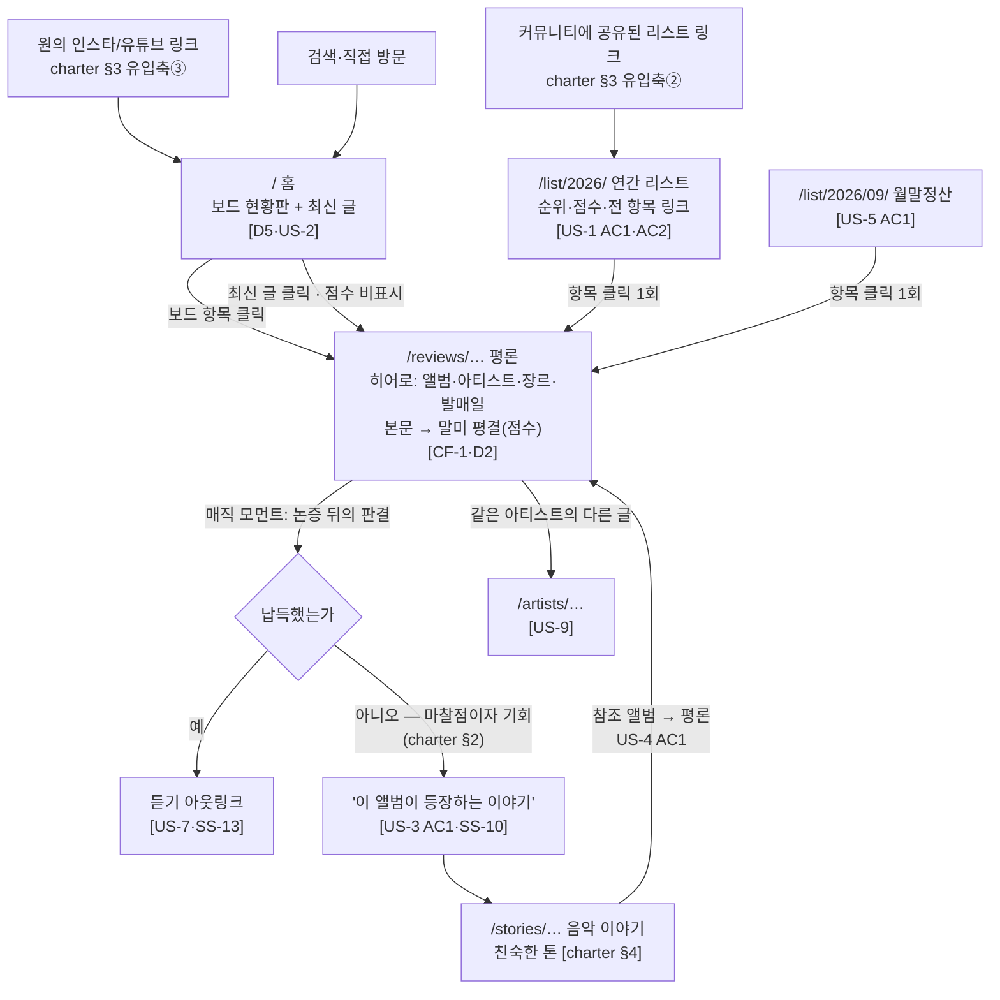
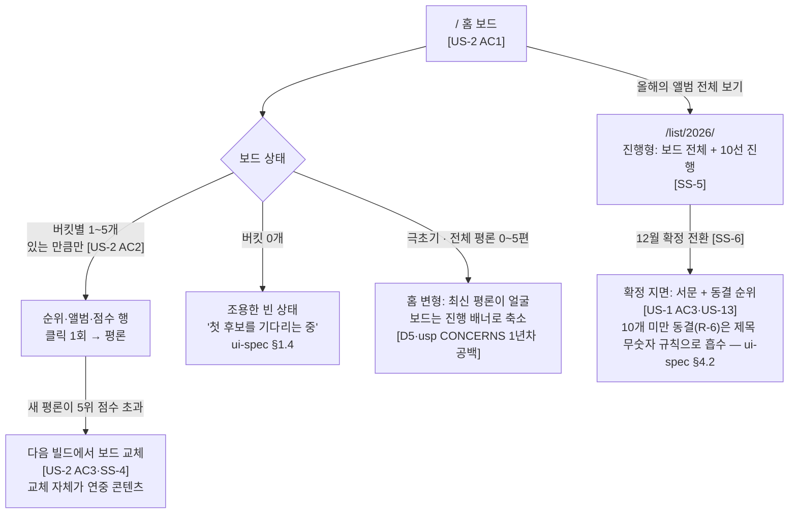
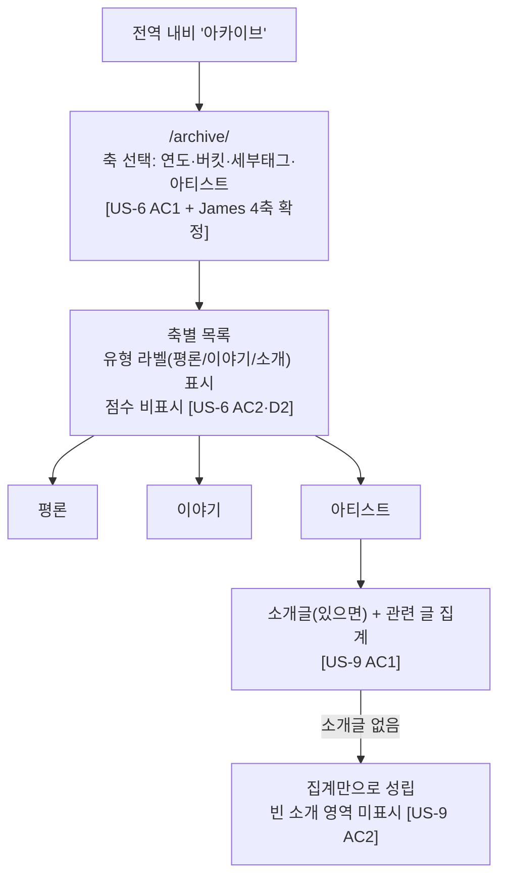
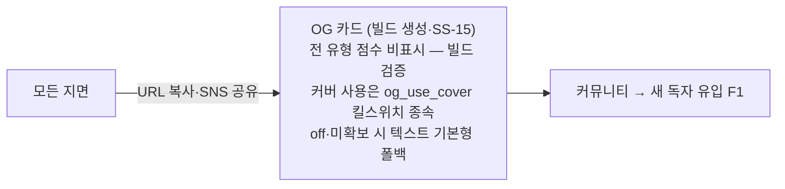
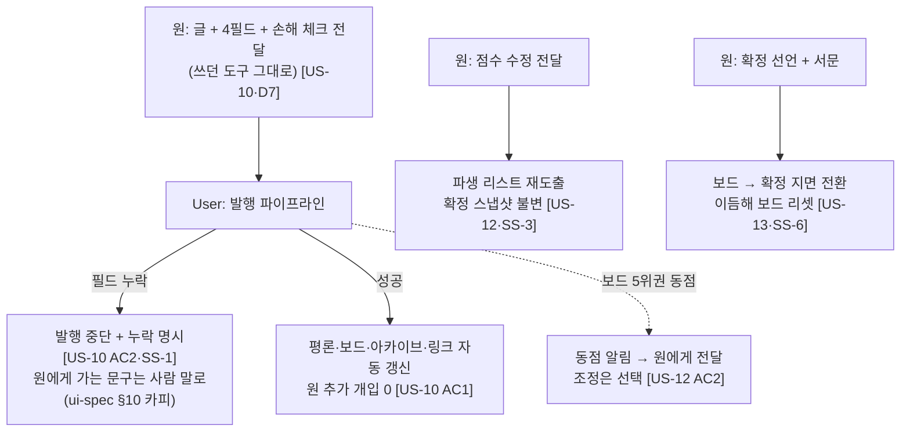

# undernote — UX Flow Map + 정보구조

| | |
|---|---|
| 작성 | Jonnathan (역할 #7 · 디자인) |
| 작성일 | 2026-09-01 (W2 2단계 · 아키 확정 델타 반영) |
| 입력 | charter v2 · Joshua 전 산출물(03-service-planning) · James 라우트/데이터 계약 (04-architecture/api-contracts.md 확정) |
| 불변식 | **플로우의 모든 단계가 US/SS 앵커를 가진다.** 앵커 없는 화면·전이 없음. 역방향 검증은 04-architecture/service-sequences.md 커버리지 매트릭스(15/15) |

---

## 0. 문제 고정 (한 문장)

> **"들을 만한데 아직 안 들은 사람"이, 링크 하나로 들어와서(리스트 유통·인스타 —
> charter §3), 믿을 만한 한 사람이 걸러 준 앨범을 발견하고, 왜 좋은지 납득한 뒤,
> 듣기로 나가게 돕는다.**

- **매직 모먼트:** 평론을 끝까지 읽고 말미에서 점수(평결)를 만나는 순간 —
  "논증 → 판결"의 순서가 신뢰를 만든다 (D2).
- **TTHW (Time-to-첫-가치):** 유입 링크 → 앨범 하나를 "듣고 싶다"고 느끼기까지.
  홈 기준 스크롤 1회 이내에 보드(후보 앨범들)가 보여야 한다.
- **최대 마찰점:** ① 긴 글 중도 이탈(→ 읽기 타이포그래피가 기능, ui-spec §2)
  ② "점수에 동의 못 함" 이탈(→ 사다리 링크, US-3) ③ 공유 링크의 빈약한
  미리보기(→ OG 카드, SS-15 연동).

## 1. 정보구조 — 화면 인벤토리 (라우트는 James 확정안)

| # | 지면 | 라우트 | 점수 표시 (D2) | 핵심 앵커 |
|---|---|---|---|---|
| 1 | 홈 = 보드 현황판 + 최신 글 | `/` | 보드 영역만 표시 · 최신 글 피드는 비표시 | D5 · US-2 · CF-7 |
| 2 | 평론 | `/reviews/{slug}/` | **말미 평결 블록만** | CF-1 · US-1·3·7 · D2 |
| 3 | 음악 이야기 | `/stories/{slug}/` | 비표시 | CF-5 · US-4 |
| 4 | 아티스트 | `/artists/{slug}/` | 비표시 | CF-6 · US-9 |
| 5 | 연간 리스트 (진행형→확정) | `/list/{year}/` | 표시 + 점수순 | CF-2·3 · US-1·2 |
| 6 | 월말정산 | `/list/{year}/{mm}/` | 표시 + 점수순 | CF-4 · US-5 |
| 7 | 아카이브 (**4축**: 연도·버킷·세부태그·아티스트) | `/archive/{year\|genre\|tag\|artist}/…` | **비표시 (데이터 계약으로 강제)** | CF-7 · US-6 · James 확정 |
| 8 | 소개/기준 | `/about/` | — (점수의 의미를 글로 설명) | CF-8 · US-8 |
| + | 404 | — | — | ui-spec §9 |

- URL·slug는 발행 후 불변 (James R-9) — 지면 내 공유는 정식 URL만 노출.
- 아카이브 4번째 축(세부태그)은 charter §1 "장르는 두 층위" 중 세밀층
  (설명 대상)의 소비처다 — 리스트 버킷과 별개로, 계보·현상 글의 세부
  분류가 탐색 가능해진다. US-6 AC3(전 글 최소 한 축 도달)은 그대로 성립.

**네비게이션 모델:** 전역 상단 마스트헤드 5항목 —
`평론 · 이야기 · 올해의 앨범 · 아카이브 · 소개`. 계층 깊이 최대 2
(홈 → 지면 → 글). "평론"·"이야기"는 아카이브의 유형 축 프리셋으로 연결
(별도 지면 아님 — 화면 8종 유지). 소개는 US-8 AC2에 따라 전역 필수.

**멘탈 모델 정합:** 독자 어휘로만 라벨링 — "리스트 지면/탐색 지면" 같은
시스템 용어 미노출. "올해의 앨범"이 진행형(노미네이트)과 확정형을 모두
담는 단일 라벨이다 — 12월 전이(SS-6)에도 URL·라벨이 바뀌지 않는 것이
"리스트는 연중 진행형"(D5)의 UI 표현이다.

## 2. 독자 플로우

### F1. 유입 → 발견 → 납득 → 듣기 (주 동선)

**엣지 (전부 화면 상태로 존재해야 함 → ui-spec · SSOT는 James exceptions.md R-4):**
- LADDER: 참조 이야기 0편 → 같은 장르 폴백 (US-3 AC2) → 폴백도 0편이면
  **영역 자체 미표시** (US-3 AC3 — 빈 껍데기 금지).
- LISTEN: 링크 0개 → 영역 미표시 (SS-13 — 발행은 막지 않음).
- STORY 참조 앨범에 평론 없음 → 플레인 텍스트 (US-4 AC2).

### F2. 진행형 리스트 관찰 (연중 재방문 동선)

### F3. 탐색 (아카이브 4축)

### F4. 공유 (유입의 역방향 — charter §3)

## 3. 원(편집자) 플로우 — 화면이 아니라 프로토콜 (D7)

원에게 UI를 만들지 않는다 (Non-goals: 관리자 UI 1차 제외). 아래는 디자인이
보장해야 하는 **원 쪽 경험의 형태**다:

## 4. 플로우 ↔ SS 1:1 검증표 (James 불변식)

| 플로우 단계 | SS | US |
|---|---|---|
| F1 리스트→평론 링크 100% | SS-8 | US-1 |
| F1 평결 블록·점수 규칙 | SS-3 | US-1 AC2 |
| F1 사다리 (평론→이야기) | SS-10 | US-3 |
| F1 이야기→평론 | SS-9 | US-4 |
| F1 듣기 아웃링크 | SS-13 | US-7 |
| F2 보드 도출·교체·배지 | SS-4 | US-2 |
| F2 10선 진행형 | SS-5 | US-1 |
| F2 확정 전환 | SS-6 | US-13 |
| F1 월말정산 | SS-7 | US-5 |
| F3 4축 인덱스 | SS-11 | US-6 |
| F3 아티스트 집계 | SS-12 | US-9·14 |
| F4 OG 카드 | SS-15 | charter §3 |
| 원 발행·검증 | SS-1·SS-2 | US-10·11 |
| 커버 처리·플레이스홀더 | SS-14 | US-10 AC3 |

잔여 없음 — 화면 8종·플로우 4+1개의 모든 전이가 SS로 해석된다.
역방향(SS인데 플로우에 없는 것)도 없음: SS-1·2는 원 플로우, SS-14는
평론 히어로 상태(ui-spec §2.4)로 소비된다. 아키 측 교차 검증:
service-sequences.md 커버리지 매트릭스 15/15.
